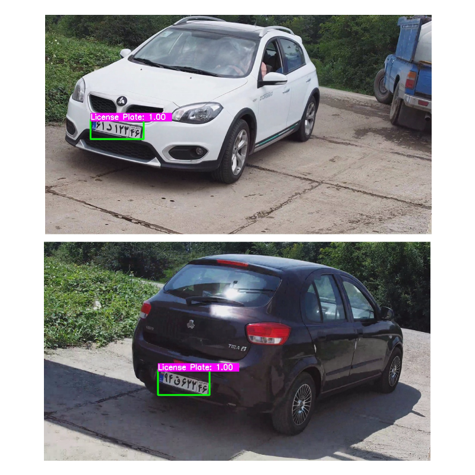

# License plate Detection by YOLO

This repository contains a method to detect **Iranian vehicle license plates** as a representation of vehicle presence in an image. We have utilized **You Only Look Once version 3 (YOLO v.3)** to detect the plates inside an input image. The method has the advantages of high accuracy and real-time performance, thanks to YOLO v.3 architecture. The presented system receives a series of vehicle images and produces the processed image with added bounding-boxes containing the vehicles' license plates. The flow of how we have trained and tested the application is published in a paper accessible from the citation section.



## 🔨 Environment

- Python v.3
- You Only Look Once (YOLO) v.3
- A vehicle image dataset containing 3000+ samples

## 💡 How to employ?

You can download the weights file from [this](https://drive.google.com/file/d/1vXjIoRWY0aIpYfhj3TnPUGdmJoHnWaOc/ "this") link. It can also be downloaded from the weights folder (splitted files).

Test on a single image:

```
python object_detection_yolo.py --image=bird.jpg
```

Test on a single video file:

```
python object_detection_yolo.py --video=cars.mp4
```

Test on the webcam:

```
python object_detection_yolo.py
```

## 🧑‍💻 Contributers

<a href="https://github.com/alitourani/yolo-license-plate-detection/graphs/contributors">
  
</a>

## 🔗 Citation

Please cite the following paper in case you have used this repo:

```
@inproceedings{Khazaee2020,
	author = {Khazaee, Saeed and Tourani, Ali and Soroori, Sajjad and Shahbahrami, Asadollah and Suen, Ching Y.},
	title = {{A Real-Time License Plate Detection Method Using a Deep Learning Approach}},
	booktitle = {Lecture Notes in Computer Science (including subseries Lecture Notes in Artificial Intelligence and Lecture Notes in Bioinformatics)},
	doi = {10.1007/978-3-030-59830-3_37},
	isbn = {9783030598297},
	issn = {16113349},
	keywords = {Automatic number-plate detection,Deep learning,Image processing,Intelligent Transportation Systems},
	pages = {425--438},
	volume = {12068 LNCS},
	year = {2020}
}
```
